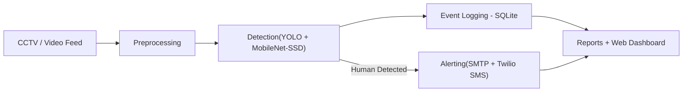
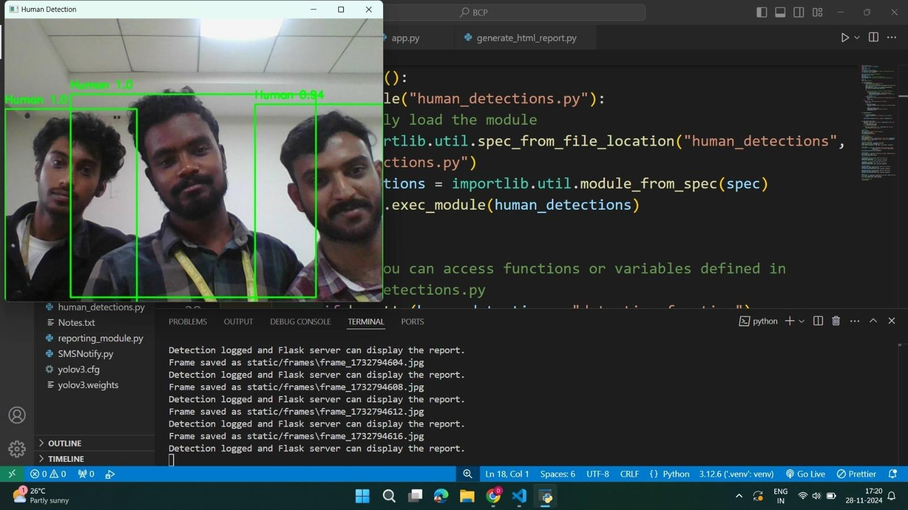
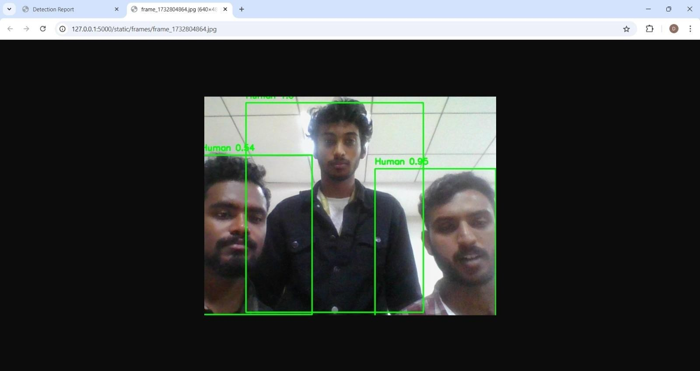
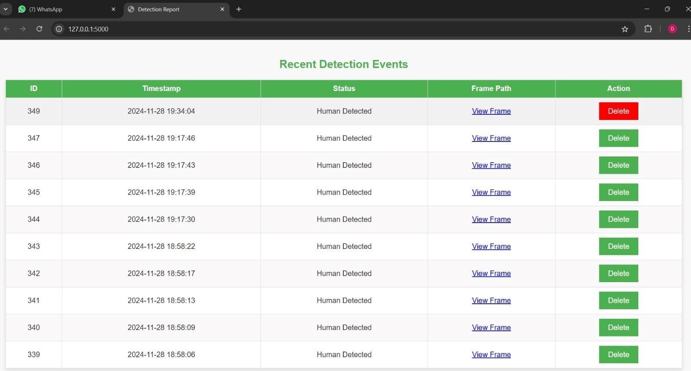
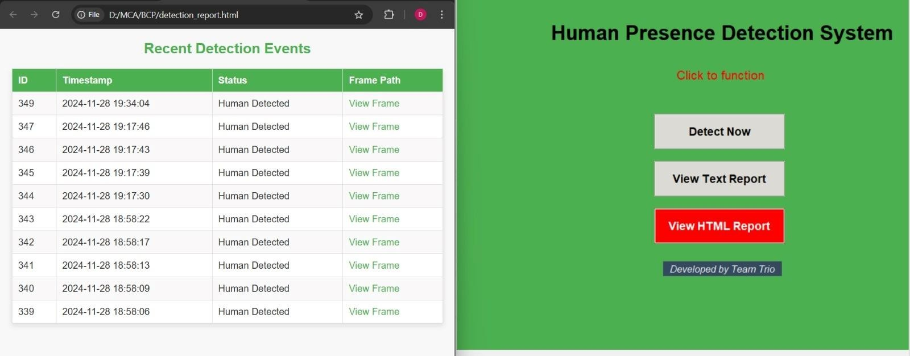
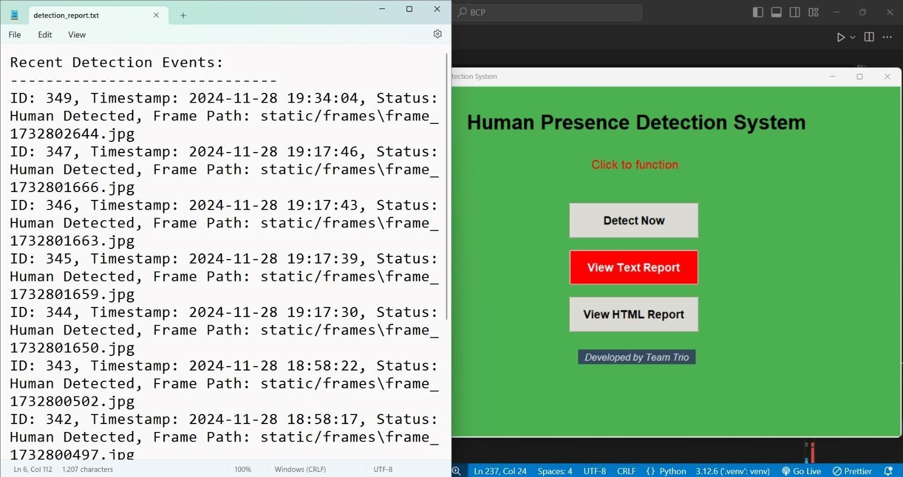
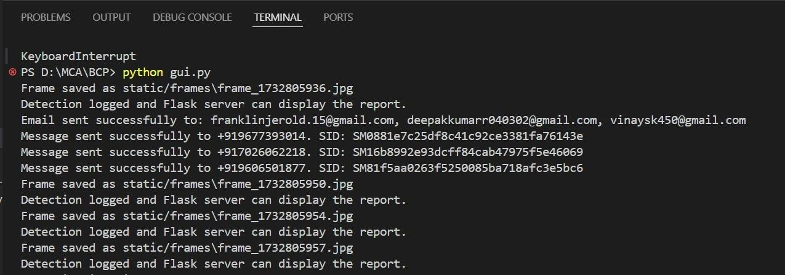
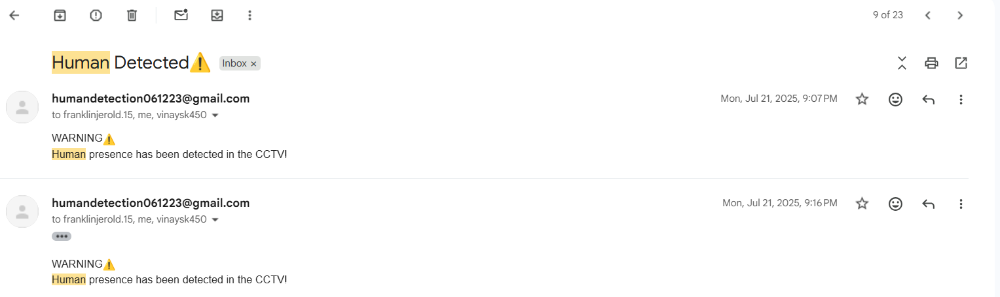
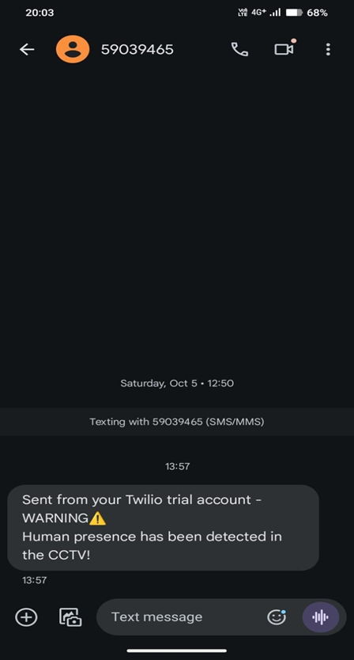

# Human Presence Detection System 🚨

A real-time computer vision–based surveillance system that detects **human presence during non-working hours** using CCTV footage and triggers instant alerts to prevent unauthorized access, Designed to automate CCTV monitoring and reduce human intervention during non-working hours.


---

## 📋 Table of Contents

- [Problem Statement](#-problem-statement)
- [Key Features](#-key-features)
- [Architecture](#-architecture)
- [Tech Stack](#-tech-stack)
- [System Workflow](#-system-workflow)
- [Why YOLO + MobileNet-SSD](#-why-yolo--mobilenet-ssd)
- [Screenshots](#-screenshots)
- [Project Structure](#-project-structure)
- [Getting Started](#-getting-started)
- [Use Cases](#-use-cases)
- [Limitations & Future Improvements](#-limitations--future-improvements)
- [Author](#-author)

---

## 🧩 Problem Statement

Traditional CCTV systems require manual monitoring, and motion-based alerts generate frequent false positives (animals, lighting changes, swaying trees). This system intelligently detects **human presence only**, ensuring:

- Reduced false alerts
- Faster response to security breaches
- Automated monitoring workflow during non-working hours — no human operator required

---

## 💡 Motivation

Manual CCTV monitoring is repetitive, expensive, and prone to human error. This project explores how computer vision can automate surveillance by detecting only human presence and triggering real-time alerts, reducing false alarms and enabling faster incident response.

---

## ✨ Key Features

- Real-time human detection using deep learning (YOLO + MobileNet-SSD)
- CCTV / video feed processing via OpenCV
- Time-based detection logic — only flags activity during configured non-working hours
- Dual-channel alerting: automated **email (SMTP)** and **SMS (Twilio)** notifications
- Event logging and report generation, viewable via a web dashboard
- Secure credential handling using environment variables (no secrets in source)

---

## 🏗️ Architecture



The system is organized into modular packages — `detection/`, `alerts/`, and a Flask-based `static/` dashboard — so each part can be maintained or upgraded independently.

---

## 🛠️ Tech Stack

| Category | Technology |
|---|---|
| **Language** | Python |
| **Computer Vision** | OpenCV |
| **Deep Learning Models** | YOLO, MobileNet-SSD |
| **DL Frameworks** | TensorFlow, PyTorch |
| **Backend Framework** | Flask |
| **GUI** | Tkinter |
| **Alerting** | SMTP (Email), Twilio (SMS) |
| **Database** | SQLite |
| **Config Management** | python-dotenv |

---

## 🔄 System Workflow

1. CCTV or video feed is captured frame-by-frame
2. Frames are preprocessed and passed to the detection module (YOLO + MobileNet-SSD)
3. Detection is checked against configured non-working hours
4. If a human is detected:
   - Event is logged to the database
   - Email (SMTP) and SMS (Twilio) alerts are sent to the administrator
5. Reports are generated and viewable via the web dashboard

---

## 🎯 Why YOLO + MobileNet-SSD?

- **YOLO** — high detection accuracy and strong real-time performance on live video streams
- **MobileNet-SSD** — lightweight and fast, useful for resource-constrained deployments
- Using both allows the system to balance **accuracy vs. speed** depending on hardware, and significantly reduces the false positives common in traditional motion-based detection

---

## 📈 Performance

- Detection Models: YOLOv3 & MobileNet-SSD
- Average Processing Speed: ~18 FPS
- Supported Input: Webcam / CCTV / MP4
- Alert Channels: Email + SMS
- False Positives: Reduced compared to motion-based detection

---

## 📸 Screenshots

### Detection in Action




### Dashboard



### Reports




📄 [View a sample generated HTML report](assets/sample-output/sample-detection-report.html) · [View a sample text report](assets/sample-output/sample-detection-report.txt)

### Alerts





---

## 📁 Project Structure

<pre>
Human-Presence-Detection/
├── app.py
├── gui.py
├── requirements.txt
├── .env.example
├── .gitignore
├── README.md
│
├── detection/
│   ├── human_detections.py
│   ├── coco.names
│   └── yolov3.cfg
│
├── alerts/
│   ├── EmailNotify.py
│   └── SMSNotify.py
│
├── static/
│   ├── frames/                     (gitignored — runtime detection captures)
│   └── detection_report.html/.txt  (gitignored — live runtime output)
│
└── assets/
    ├── screenshots/
    └── sample-output/              (frozen sample report, committed for reference)
</pre>
---

## 🚀 Getting Started

### Clone the repository

```bash
git clone https://github.com/Deepak-kumar-4/Human-Presence-Detection.git
cd Human-Presence-Detection
```

### Create and activate a virtual environment

```bash
python -m venv .venv

# Linux / macOS
source .venv/bin/activate

# Windows
.venv\Scripts\activate
```

### Install dependencies

```bash
pip install -r requirements.txt
```

### Download model weights

Due to GitHub file size limits, YOLO weight files are not included in this repo.

Download `yolov3.weights` from the official Darknet website: https://pjreddie.com/media/files/yolov3.weights

Place the file in the project root directory before running the application.

### Configure environment variables

Copy `.env.example` to `.env` and fill in your own values:
```env
EMAIL_SENDER=your_email@gmail.com
EMAIL_APP_PASSWORD=your_gmail_app_password
EMAIL_RECIPIENTS=recipient1@example.com,recipient2@example.com
TWILIO_ACCOUNT_SID=your_account_sid
TWILIO_AUTH_TOKEN=your_auth_token
TWILIO_PHONE_NUMBER=your_twilio_number
SMS_RECIPIENTS=+1XXXXXXXXXX,+1XXXXXXXXXX
```
`.env` is excluded from version control — never commit real credentials.

---

## 🏢 Use Cases

- Office security after working hours
- Shop and warehouse surveillance
- Restricted area monitoring
- Campus and lab security

---

## ⚠️ Limitations & Future Improvements

- Detection accuracy depends on lighting and camera angle
- Requires stable camera placement
- Model weights must be downloaded separately (not bundled due to size)
- **Planned:** containerize with Docker for easier deployment
- **Planned:** add a lightweight cloud deployment option for live demos

---

## 🏛️ Design Decisions

- Modular detection pipeline
- Separation of alerting services
- Environment-based configuration
- Database-backed reporting
- Runtime artifact isolation

---


## 👤 Author

**Deepak Kumar B** <br>
Full Stack Developer | MCA, St Joseph's University

[GitHub](https://github.com/Deepak-kumar-4) · [LinkedIn](https://linkedin.com/in/deepak-kumar-b-dee412)
